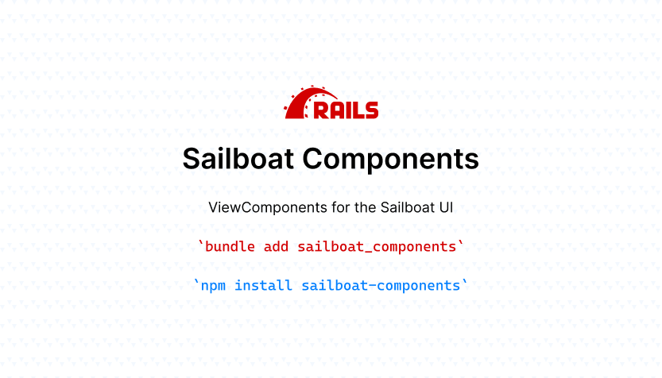

<p align="center">
  
</p>

# Sailboat Components

ViewComponents for the Sailboat UI.

## Usage (IN PROGRESS)
How to use my plugin.

## Installation
Add this line to your application's Gemfile:

```ruby
gem "sailboat_components"
```

And then execute:
```bash
$ bundle
```

Or install it yourself as:
```bash
$ gem install sailboat_components
```

## Contributing
Contribution directions go here.

## License
The gem is available as open source under the terms of the [MIT License](https://opensource.org/licenses/MIT).
